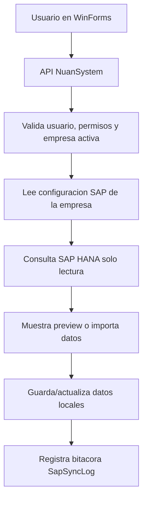

# Guia de sincronizacion SAP Business One

## Proposito

Esta guia explica, paso a paso, como se esta construyendo la sincronizacion entre NuanSystem y SAP Business One.

El objetivo inicial es sincronizar:

- Proveedores.
- Items.
- Ordenes de compra.

La sincronizacion se hara desde el backend. El frontend WinForms solo mostrara pantallas y enviara solicitudes a la API.

## Explicacion simple

NuanSystem y SAP Business One son dos sistemas separados.

Para que trabajen juntos necesitamos tres cosas:

1. Saber a que empresa SAP conectarnos.
2. Leer informacion desde SAP HANA.
3. Guardar o actualizar esa informacion dentro de NuanSystem.

Ejemplo:

```text
SAP tiene el proveedor P000123.
NuanSystem consulta SAP.
NuanSystem revisa si ya existe ese proveedor.
Si no existe, lo crea.
Si existe, actualiza los campos permitidos.
Luego guarda una bitacora indicando que paso.
```

## Reglas importantes

- WinForms nunca se conecta directo a SAP.
- WinForms nunca se conecta directo a HANA.
- Todo pasa por la API.
- Las consultas HANA seran solo lectura.
- La escritura hacia SAP debe hacerse por Service Layer.
- Las claves y passwords se guardan cifrados.
- Los errores tecnicos se registran en logs, pero al usuario se le muestra un mensaje claro.
- Cada intento de sincronizacion debe dejar bitacora.

## Flujo general



## Configuracion SAP por empresa

La configuracion SAP vive en la base master, tabla:

```text
dbo.SapCompanySettings
```

Campos principales:

| Campo | Para que sirve |
|---|---|
| `CompanyId` | Empresa local de NuanSystem. |
| `IsEnabled` | Indica si SAP esta activo para esa empresa. |
| `IntegrationMode` | Modo SAP: ninguno, Service Layer o DI API. |
| `ServiceLayerUrl` | URL del Service Layer de SAP. |
| `SapCompanyDb` | Base de datos SAP Business One. |
| `SapUser` | Usuario SAP. |
| `SapPasswordEncrypted` | Password SAP cifrado. |
| `HanaServer` | Servidor HANA. |
| `HanaPort` | Puerto HANA. |
| `HanaSchema` | Schema/base SAP en HANA. |
| `HanaUser` | Usuario HANA de solo lectura. |
| `HanaPasswordEncrypted` | Password HANA cifrado. |
| `MaxRetryCount` | Cantidad maxima de reintentos controlados. |

Ejemplo conceptual:

```text
Empresa: NUAN_DEMO
SAP activo: Si
Service Layer: https://sap-server:50000/b1s/v1
HANA server: sap-hana-server
HANA schema: SBODEMOEC
HANA user: NUAN_READONLY
```

## Lo implementado hasta ahora

### Application

Se agrego el contrato:

```text
ISapCompanySettingsRepository
```

Este contrato permite que Application pida la configuracion SAP sin saber si viene de SQL Server, HANA, archivo o cualquier otra fuente.

Archivo:

```text
src/Backend/NuanSystem.Application/Abstractions/Sap/ISapCompanySettingsRepository.cs
```

Tambien se agrego el DTO:

```text
SapCompanySettingsDto
```

Archivo:

```text
src/Backend/NuanSystem.Application/Features/SapSync/Dtos/SapCompanySettingsDto.cs
```

### Persistence

Se agrego la implementacion SQL Server:

```text
SapCompanySettingsRepository
```

Archivo:

```text
src/Backend/NuanSystem.Persistence/Repositories/SapCompanySettingsRepository.cs
```

Este repositorio lee la configuracion desde `NuanSystem_Master`.

### Base de datos

Se agregaron campos HANA a `dbo.SapCompanySettings`.

Archivos:

```text
database/sql/001_master_database.sql
src/Backend/NuanSystem.Persistence/Services/SqlServerMasterDatabaseInitializer.cs
```

### Cliente HANA solo lectura

Se agrego una capa tecnica para abrir conexiones HANA y ejecutar consultas de lectura.

Archivos:

```text
src/Backend/NuanSystem.SapIntegration/Hana/ISapHanaConnectionFactory.cs
src/Backend/NuanSystem.SapIntegration/Hana/ISapHanaQueryClient.cs
src/Backend/NuanSystem.SapIntegration/Hana/SapHanaConnectionFactory.cs
src/Backend/NuanSystem.SapIntegration/Hana/SapHanaQueryClient.cs
```

Responsabilidades:

- Leer la configuracion SAP/HANA de la empresa.
- Validar que SAP este activo.
- Validar que la configuracion HANA este completa.
- Desencriptar el password HANA solo al abrir la conexion.
- Ejecutar solamente consultas `SELECT`.
- Rechazar sentencias que no sean de lectura.

Importante:

```text
El backend compila sin depender directamente del paquete SAP HANA.
En el servidor de la API debe estar instalado/registrado el proveedor ADO.NET Sap.Data.Hana.
```

Si el proveedor no esta instalado, el sistema devolvera un error tecnico controlado indicando que `Sap.Data.Hana` no esta registrado.

Ejemplo conceptual de uso interno:

```csharp
var suppliers = await hanaQueryClient.QueryAsync(
    companyId,
    sql,
    reader => new SapSupplierRecord(
        reader.GetString(reader.GetOrdinal("CardCode")),
        reader.GetString(reader.GetOrdinal("CardName"))),
    cancellationToken: cancellationToken);
```

Este ejemplo no es codigo de pantalla. Es una muestra de como un servicio backend leera datos desde SAP HANA.

### Preview de proveedores desde SAP

Se agrego el primer preview real contra SAP HANA para proveedores.

Piezas agregadas:

```text
src/Backend/NuanSystem.Application/Abstractions/Sap/ISapSupplierReader.cs
src/Backend/NuanSystem.Application/Features/SapSync/Dtos/SapSupplierRecord.cs
src/Backend/NuanSystem.Application/Features/SapSync/Dtos/SapSupplierPreviewItemDto.cs
src/Backend/NuanSystem.Application/Features/SapSync/Queries/PreviewSuppliersFromSapQuery.cs
src/Backend/NuanSystem.Application/Features/SapSync/Queries/PreviewSuppliersFromSapQueryHandler.cs
src/Backend/NuanSystem.SapIntegration/Suppliers/SapSupplierReader.cs
```

Endpoint:

```text
GET /api/sap/suppliers/preview
```

Permiso requerido:

```text
SAP.SYNC.READ
```

Que hace:

1. Valida que exista una empresa activa.
2. Consulta proveedores en SAP HANA desde `OCRD`.
3. Consulta proveedores locales en NuanSystem.
4. Compara cada proveedor SAP contra el proveedor local.
5. Devuelve una lista de preview sin guardar cambios.

Estados del preview:

| Estado tecnico | Texto usuario | Significado |
|---|---|---|
| `New` | Nuevo | Existe en SAP y no se encontro en NuanSystem. |
| `Existing` | Existente | Ya existe localmente y no se detectaron diferencias basicas. |
| `Different` | Diferente | Existe localmente, pero tiene diferencias de nombre, email, telefono o estado. |
| `Conflict` | Conflicto | Hay posible duplicidad o coincidencia por identificacion sin relacion SAP confirmada. |

Ejemplo de respuesta:

```json
[
  {
    "sapCardCode": "P000123",
    "sapCardName": "COMERCIAL ABC S.A.",
    "taxIdentification": "0999999999001",
    "email": "compras@comercialabc.com",
    "phone": "042000000",
    "currency": "USD",
    "isActiveInSap": true,
    "status": "New",
    "statusName": "Nuevo",
    "localBusinessPartnerId": null,
    "localCode": null,
    "localName": null,
    "differenceSummary": null
  }
]
```

Regla de comparacion inicial:

- Primero busca proveedor local por `SapCardCode`.
- Si no encuentra, busca por codigo local igual a `CardCode`.
- Si no encuentra, revisa identificacion fiscal.
- Si coincide por identificacion pero no por codigo SAP, marca `Conflicto`.
- Si existe por codigo SAP, compara nombre, email, telefono y estado.

## Importacion real de proveedores

La primera importacion backend de proveedores SAP ya queda preparada con estas piezas:

```text
ImportSuppliersFromSapCommand
SapSupplierImportResultDto
POST /api/sap/suppliers/import
SP_NA_POST_BUSINESSPARTNERS_IMPORTARSAP
```

### Como usarlo

1. El usuario debe iniciar sesion en NuanSystem.
2. El usuario debe seleccionar una empresa activa; el API recibe esa empresa por `X-Company-Code`.
3. La empresa debe tener configurados los datos HANA de SAP Business One.
4. Primero se recomienda consultar:

```http
GET /api/sap/suppliers/preview
```

5. Luego se ejecuta la importacion:

```http
POST /api/sap/suppliers/import
```

El endpoint de importacion requiere permiso `SAP.SYNC.MANAGE`, porque crea o actualiza proveedores locales.

### Que hace internamente

1. Lee proveedores desde SAP HANA usando `OCRD`.
2. Busca proveedores locales por `SapCardCode`.
3. Si no encuentra, busca por codigo local igual a `CardCode`.
4. Si encuentra la misma identificacion fiscal en cualquier socio de negocio local, pero sin relacion SAP, omite el registro como conflicto.
5. Si es nuevo, crea el proveedor local como `BusinessPartner` tipo `Supplier`.
6. Si existe y hay diferencias, actualiza nombre, email, telefono, moneda, estado y mapeo SAP.
7. Registra el resumen en `dbo.SapSyncLog`.

### Ejemplo de respuesta

```json
{
  "totalRead": 5,
  "created": 2,
  "updated": 1,
  "unchanged": 1,
  "skipped": 1,
  "failed": 0,
  "items": [
    {
      "sapCardCode": "P000123",
      "sapCardName": "COMERCIAL ABC S.A.",
      "status": "Created",
      "message": "Proveedor creado desde SAP.",
      "localBusinessPartnerId": 18
    }
  ]
}
```

### Estados por registro

- `Created`: el proveedor no existia y fue creado.
- `Updated`: el proveedor existia y fue actualizado.
- `Unchanged`: el proveedor ya estaba actualizado.
- `Skipped`: el proveedor fue omitido por datos incompletos o conflicto.
- `Failed`: el proveedor no pudo importarse por un error tecnico controlado.

## Primeras consultas HANA esperadas

### Proveedores

```sql
SELECT
    "CardCode",
    "CardName",
    "LicTradNum",
    "CardType",
    "GroupCode",
    "Phone1",
    "E_Mail",
    "Currency",
    "ValidFor",
    "CreateDate",
    "UpdateDate"
FROM "{SCHEMA}"."OCRD"
WHERE "CardType" = 'S'
ORDER BY "CardCode";
```

### Items

```sql
SELECT
    "ItemCode",
    "ItemName",
    "ItmsGrpCod",
    "InvntryUom",
    "BuyUnitMsr",
    "SalUnitMsr",
    "ManBtchNum",
    "ManSerNum",
    "validFor",
    "CreateDate",
    "UpdateDate"
FROM "{SCHEMA}"."OITM"
ORDER BY "ItemCode";
```

### Ordenes de compra

Cabecera:

```sql
SELECT
    "DocEntry",
    "DocNum",
    "CardCode",
    "CardName",
    "DocDate",
    "DocDueDate",
    "TaxDate",
    "DocCur",
    "DocTotal",
    "DocStatus",
    "CANCELED",
    "Comments",
    "CreateDate",
    "UpdateDate"
FROM "{SCHEMA}"."OPOR"
ORDER BY "DocEntry";
```

Detalle:

```sql
SELECT
    "DocEntry",
    "LineNum",
    "ItemCode",
    "Dscription",
    "Quantity",
    "Price",
    "Currency",
    "WhsCode",
    "LineTotal",
    "TaxCode",
    "OpenQty",
    "LineStatus"
FROM "{SCHEMA}"."POR1"
WHERE "DocEntry" = ?
ORDER BY "LineNum";
```

## Guia de usuario

Cuando exista la pantalla de sincronizacion, el usuario vera algo parecido a esto:

1. Entrar a `Integracion SAP`.
2. Seleccionar una pestaña: `Proveedores`, `Items` u `Ordenes de compra`.
3. Presionar `Consultar SAP`.
4. Revisar los registros encontrados.
5. Ver el estado de cada registro:
   - `Nuevo`: existe en SAP pero no en NuanSystem.
   - `Existente`: ya esta relacionado.
   - `Diferente`: existe pero tiene cambios.
   - `Conflicto`: necesita revision manual.
   - `Error`: no pudo procesarse.
6. Seleccionar registros.
7. Presionar `Importar seleccionados`.
8. Revisar el resultado y la bitacora.

Ejemplo de usuario:

```text
Necesito traer proveedores de SAP.
Abro Integracion SAP > Proveedores.
Presiono Consultar SAP.
El sistema muestra 250 proveedores.
Marco 10 proveedores nuevos.
Presiono Importar seleccionados.
El sistema crea esos proveedores en NuanSystem y muestra el resultado.
```

## Estado del proyecto

| Area | Estado |
|---|---|
| Configuracion SAP por empresa | Implementado inicial |
| Campos HANA en master | Implementado inicial |
| Cliente HANA read-only | Implementado inicial |
| Preview proveedores | Implementado inicial |
| Importacion proveedores | Pendiente |
| Preview items | Pendiente |
| Importacion items | Pendiente |
| Preview ordenes de compra | Pendiente |
| Importacion ordenes de compra | Pendiente |
| Envio a SAP por Service Layer | Pendiente |
