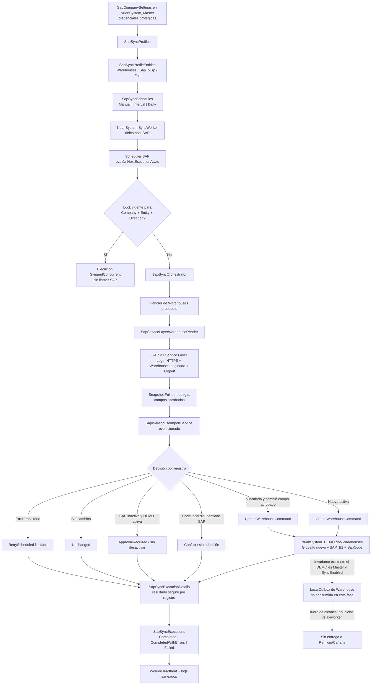
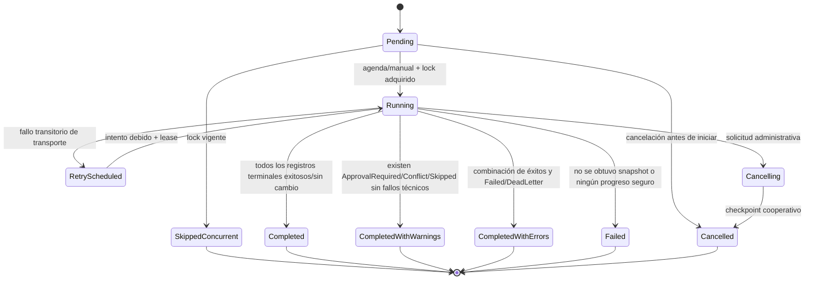
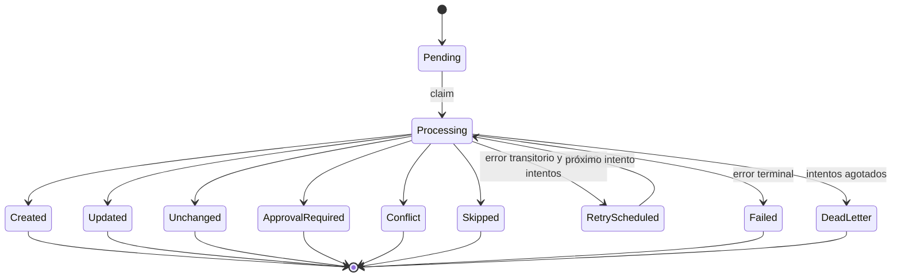

# Fase 10.1 — Blueprint de perfiles de sincronización SAP

## Estado y alcance

- Fecha de discovery: 2026-07-30.
- Rama de trabajo: `refactor/codex-skills-v10-sap-profiles`.
- Estado: arquitectura aprobada; persistencia y contratos de Fase 10.2 desplegados y validados en el alcance autorizado. La Fase 10.3 se limita a Application, API y seguridad backend de perfiles.
- Fuente SAP del piloto: SAP Business One mediante Service Layer.
- Único tenant destino del piloto: empresa `DEMO`, base `NuanSystem_DEMO`.
- Fuera de alcance: `NuanSystem.MasterBranchSyncWorker`, Remigio, Cañaris, SRI, ejecución de SQL, llamadas SAP, inicio de API/WinForms/workers y cambios de código funcional.

Este documento separa dos dominios que hoy tienen infraestructura y propósitos diferentes:

1. **Perfiles SAP Business One:** SAP → tenant ERP (`DEMO` en el piloto).
2. **Perfiles Matriz–Sucursal:** tenant Matriz (`DEMO`) → tenants Sucursal (Remigio/Cañaris).

La decisión aprobada es mantener dos modelos funcionales, dos formularios, dos contratos de seguridad y dos historiales de ejecución independientes. Una experiencia visual consistente no implica compartir tablas, endpoints, DTOs, ViewModels ni permisos. Un centro general de monitoreo podrá componerse después, por lectura, sobre ambos historiales.

El plan de comprobación correspondiente está en [SAP-WAREHOUSE-SYNC-VALIDATION-PLAN.md](../operations/SAP-WAREHOUSE-SYNC-VALIDATION-PLAN.md).

## Cierre aprobado de Fase 10.2

La validación SQL real fue aprobada por el propietario el 2026-07-30 con el siguiente alcance saneado:

- los respaldos `COPY_ONLY WITH CHECKSUM` de `NuanSystem_Master` y `NuanSystem_DEMO` fueron creados y verificados;
- `152_master_sap_sync_profiles.sql` se ejecutó dos veces únicamente en Master y `153_tenant_sap_sync_execution_history.sql` dos veces únicamente en DEMO;
- las versiones `20260730.152` y `20260730.153` quedaron registradas una sola vez;
- tablas, procedimientos, índices, claves, checks, defaults, auditoría y contratos Dapper fueron materializados y comprobados;
- los perfiles heredados, sus entidades y agendas Manual quedaron inactivos, sin dual-write, con fallback de solo lectura y dos ciclos exitosos requeridos antes de retirarlo;
- los doce permisos SAP independientes existen una sola vez y permanecen concedidos únicamente a `ADMIN`;
- `SapSyncEntitySettings` no fue modificada, los objetos tenant no tienen claves foráneas hacia Master y los locks preexistentes conservaron su identidad;
- las pruebas de idempotencia y concurrencia de `ExecutionUid`, locks renovables, snapshots allowlist y transiciones terminaron conformes, sin fixtures residuales;
- build y suites automatizadas terminaron conformes;
- no se llamó SAP, Service Layer ni SRI; no se iniciaron API, WinForms o workers; no se tocó Remigio ni Cañaris.

Este registro omite deliberadamente rutas de respaldos, hashes completos, conexiones y cualquier otro dato sensible. La validación no activó perfiles ni agendas y no autoriza scheduler, ejecuciones runtime, Bodegas o formularios.

## Decisiones rectoras

- `NuanSystem.SyncWorker` sigue siendo el único proceso host para sincronización SAP. No se crea otro worker para Bodegas.
- `NuanSystem.MasterBranchSyncWorker` conserva la propiedad exclusiva de Matriz–Sucursal.
- `SyncProfiles`, `SyncProfileEntities`, `SyncSchedules`, `SyncProfileExecutions` y `SyncProfileExecutionDetails` continúan siendo Matriz–Sucursal. No se renombran, reutilizan ni reinterpretan para SAP.
- Los nuevos contratos SAP se proponen con nombres propios: `SapSyncProfiles`, `SapSyncProfileEntities`, `SapSyncSchedules`, `SapSyncExecutions` y `SapSyncExecutionDetails`.
- `SapCompanySettings` continúa siendo la fuente de configuración técnica y credenciales protegidas por empresa; un perfil no duplica URL, usuario, contraseña, cookie, token ni cadena de conexión.
- `Worker:LoopDelaySeconds` queda como frecuencia técnica de sondeo del host, no como agenda de negocio.
- La agenda de negocio se define por entidad, con disparo `Manual`, `Interval` o `Daily`.
- `WorkerHeartbeat` continúa siendo la superficie compartida de salud. El perfil y el historial SAP no crean una tabla de heartbeat paralela.
- La primera automatización de Bodegas es una lectura **Full** SAP → `NuanSystem_DEMO`. No distribuye a sucursales y no llama a SAP desde WinForms.

## Registro de decisiones aprobadas

Decisiones aprobadas por el propietario el 2026-07-30:

1. Una bodega SAP nueva inactiva no se crea en DEMO: queda `Skipped` con código seguro `SAP_WAREHOUSE_INACTIVE`.
2. La importación conserva la generación normal de `LocalOutbox`; el relay y `NuanSystem.MasterBranchSyncWorker` permanecen apagados en esta fase.
3. El retry por registro reutiliza `ApprovedSnapshotJson` estrictamente tipado/allowlist y su `SnapshotHash`. Si la lectura Full falla antes de obtener el snapshot, se repite la consulta SAP completa.
4. `Both` no se muestra en la UI inicial y el backend lo rechaza mientras ambos sentidos no estén explícitamente implementados en el catálogo de capacidades.
5. El perfil SAP nuevo tiene prioridad. `SapSyncEntitySettings` es fallback de solo lectura únicamente cuando la empresa no tiene perfiles nuevos, mediante feature flag, durante una versión y sin dual-write. Su retiro exige dos ciclos exitosos por cada entidad activa.
6. Durante desarrollo, los permisos nuevos se conceden únicamente al rol `ADMIN`.
7. La retención de `SapSyncExecutions` y detalles es indefinida durante desarrollo; no existe purga automática.
8. Se persisten columnas seguras, `ApprovedSnapshotJson` tipado/allowlist y `SnapshotHash`; nunca respuestas SAP completas, Login, cookies, headers, tokens, usuarios técnicos, contraseñas ni conexiones.
9. La cancelación cooperativa termina el registro actual, no inicia el siguiente y cierra la ejecución como `Cancelled`.
10. Una hora Daily inexistente se omite y una hora duplicada se ejecuta una sola vez. Se persiste UTC y `America/Guayaquil` es la zona predeterminada.

## Discovery Record

**Outcome:** definir la arquitectura independiente de perfiles SAP y el piloto Full de Bodegas SAP → DEMO.

**Work type:** documentación arquitectónica de integración/sincronización de alto riesgo.

**Domain:** SAP Business One, con Matriz–Sucursal inspeccionado únicamente para fijar el límite de no reutilización.

**Explicit domain decisions and exclusions:** dos tipos de perfil, dos formularios, dos contratos de seguridad, dos historiales; un solo worker SAP; sin otro worker de Bodegas; DEMO único destino; Remigio/Cañaris y `NuanSystem.MasterBranchSyncWorker` fuera de alcance.

**Affected layers futuros:** Application, Persistence, API, base Master, base tenant, `NuanSystem.SapIntegration`, `NuanSystem.SyncWorker`, servicios/ViewModels/formularios WinForms, seguridad y pruebas. En Fase 10.1 solo cambia documentación.

**Risk:** alto por programación, concurrencia, idempotencia, credenciales, estado externo y compatibilidad.

**Selected patterns:**

- Ingesta SAP: `SapServiceLayerWarehouseReader` → `SapWarehouseImportService` → comandos de Bodega.
- Orquestación SAP: `SapSyncWorker` → settings → `SapSyncOrchestrator` → lock → `ISapSyncEntityHandler` → log.
- Referencia de ciclo de vida administrativo, no de dominio: formularios `SyncProfileListForm`/`SyncProfileEditForm` y `SyncExecutionListForm`/`SyncExecutionDetailForm`.
- Referencia de agenda e historial, no reutilización: `SyncSchedules`, `SyncProfileExecutions` y `SyncProfileExecutionDetails`.

**Permitted reuse boundary:**

- Se reutilizan técnicas de agenda, estados, grillas, formularios base, controles corporativos, `INuanApiClient`, auditoría, locks con vencimiento, `WorkerHeartbeat` y cálculo de zona horaria.
- No se reutilizan el agregado `SyncProfiles`, sus tablas, repositorios, endpoints, clientes, ViewModels, FormKeys, permisos ni formularios concretos para configurar SAP.

**Alternatives rejected:**

- Agregar campos SAP a `SyncProfiles`: rompe propiedad de dominio y mezcla destinos sucursal con origen externo.
- Usar `Worker:LoopDelaySeconds` como frecuencia por entidad: es global, técnica y no expresa zona horaria ni próxima ejecución.
- Crear `NuanSystem.SapWarehouseWorker`: contradice la decisión de un solo worker SAP.
- Usar `SapSyncLog` o `SapSyncTechnicalLog` como único historial: ninguno representa perfil, agenda, ejecución agrupada y resultados por registro.
- Enviar Bodegas a `SyncOutbox` como si SAP fuera una sucursal: confunde los dos pipelines.

**Gaps/new code futuros:** vertical SAP Profiles independiente, persistencia Master/tenant, agenda por entidad, ejecuciones por entidad/dirección, detalle por registro, handler programado de Bodegas y UI/seguridad propias.

**Confidence:** alta para el estado actual, el límite de separación y las decisiones de migración aprobadas.

## Estado actual verificable

### Runtime SAP

| Evidencia | Responsabilidad comprobada | Límite observado |
|---|---|---|
| `src/Backend/NuanSystem.SyncWorker/Program.cs` | Registra `SapSyncWorker`, `SapRetryWorker` y `SapOutboxWorker` en el mismo host Windows Service. | No existe un worker específico de Bodegas. |
| `src/Backend/NuanSystem.SyncWorker/Workers/SapSyncWorker.cs` | Descubre empresas SAP activas, establece `ICompanyContext`, carga settings habilitados, filtra SAP → ERP, ordena y llama al orquestador. | No consulta perfiles ni agendas; repite el ciclo según `Worker:LoopDelaySeconds`. |
| `src/Backend/NuanSystem.SyncWorker/Workers/SapRetryWorker.cs` | Libera locks vencidos de inbox y evalúa reintentos. | Está acoplado a `SapSyncEntityCode.Suppliers`; no reprocesa el payload ni ejecuta de nuevo el handler. |
| `src/Backend/NuanSystem.SyncWorker/Workers/SapOutboxWorker.cs` | Emite heartbeat por empresa. | Publica estado `NotImplemented`; no entrega ERP → SAP. |
| `src/Backend/NuanSystem.SyncWorker/Options/WorkerOptions.cs` | Define `Enabled`, `InstanceName`, `LoopDelaySeconds`, `MaxParallelCompanies` y `MaxParallelJobsPerCompany`. | Los nombres `MaxParallel*` no prueban paralelismo: el código usa `Take(...)` y bucles secuenciales. |
| `src/Backend/NuanSystem.SyncWorker/appsettings.json` | Configura sondeo global de 30 segundos, defaults SAP, retry y Service Layer. | `Worker:LoopDelaySeconds` no es intervalo por entidad. |

Hallazgos adicionales:

- `SapSyncWorker` aplica `Take(MaxParallelCompanies)` y `Take(MaxParallelJobsPerCompany)`. Si existen más empresas o entidades que esos límites, el subconjunto posterior no se procesa en ese ciclo; no se observó rotación.
- `SapSyncEntitySettingsDto.BatchSize` y `MaxRetryCount` se cargan, pero `SapSyncOrchestrator` no los incorpora al `SapSyncExecutionContext`; los handlers actuales no reciben esos valores.
- `SapSyncOptions.ExecutionTimeoutMinutes` está configurado, pero no se observó su aplicación en el orquestador.
- El heartbeat actual del worker SAP usa el constructor legado de `WorkerHeartbeatDto`; no llena el conjunto operacional ampliado (`LifecycleState`, conteos, último ciclo exitoso, leases).

### Orquestación, handlers y estado técnico

| Evidencia | Estado comprobado |
|---|---|
| `src/Backend/NuanSystem.Application/Features/SapSync/Services/SapSyncOrchestrator.cs` | Crea correlación, adquiere lock por empresa/entidad/dirección, resuelve handler, ejecuta, registra log y libera lock en `finally`. |
| `src/Backend/NuanSystem.Application/Abstractions/SapSync/ISapSyncEntityHandler.cs` | Contrato con `EntityCode`, `ImportFromSapAsync` y `ExportToSapAsync`. |
| `src/Backend/NuanSystem.Application/DependencyInjection/ApplicationServiceRegistration.cs` | Registra handlers de Suppliers, Items, PurchaseOrders y PaymentTerms. |
| `SapSupplierSyncHandler` | Import SAP → ERP operativo; export no implementado. |
| `SapItemSyncHandler` | Import SAP → ERP operativo; export no implementado. |
| `SapPurchaseOrderSyncHandler` | Ambos sentidos devuelven `NotImplemented`. |
| `SapPaymentTermSyncHandler` | Import Full SAP → ERP operativo; ERP → SAP fuera del alcance aprobado. |
| `SapSyncEntityCode` | Declara `Suppliers`, `Items`, `PurchaseOrders` y `PaymentTerms`; no declara Bodegas. |
| `SapSyncJobRunner` | Outbox ERP → SAP `NotImplemented`; inbox devuelve `Skipped`. |

La dirección `Both` existe en el enum y en seeds, pero el orquestador, cuando recibe `Both`, ejecuta únicamente importación SAP → ERP. No debe mostrarse como sincronización bidireccional completa.

### Persistencia SAP actual

| Ubicación | Objetos/contratos | Observación |
|---|---|---|
| Master, `database/sql/001_master_database.sql` | `SapCompanySettings` | Configuración técnica y secretos cifrados por empresa. |
| Master, `database/sql/049_master_sap_sync_worker.sql` | `SapSyncEntitySettings`, `WorkerHeartbeat` legado | Settings planos por empresa/entidad/dirección; sin perfil ni agenda. |
| Tenant, `database/sql/050_tenant_sap_sync_worker.sql` | `SapSyncWatermark`, `SapSyncInbox`, `SapSyncOutbox`, `SapSyncLock`, `SapSyncConflict`, `SapSyncTechnicalLog` | Base técnica existente para idempotencia, locks, colas y logs. |
| Master, scripts `120` y `122` | Evolución de `WorkerHeartbeat` | Identidad lógica, lifecycle, conteos, leases y health compartido; conserva compatibilidad SAP. |
| `SapSyncSettingsRepository` | Lee SQL inline de `SapSyncEntitySettings`. | No existe CRUD, auditoría ni API de perfiles SAP. |
| `SapSyncLockRepository` | Borra lock vencido y adquiere con bloqueo serializable; libera por owner/correlation. | No renueva lease ni vincula una ejecución persistida. |
| `SapSyncWatermarkRepository` | Guarda último éxito por empresa/entidad/dirección. | El uso es específico por handler; no es historial de ejecución. |
| `SapSyncInboxRepository` | Claim con `READPAST`/`UPDLOCK`, attempts, retry y DeadLetter. | La escritura `UpsertSupplierAsync` y el retry worker evidencian alcance específico de proveedores. |
| `SapSyncOutboxRepository` | Claim y estados de salida. | El runner de entrega sigue no implementado. |
| `SapSyncTechnicalLogRepository` | Persiste un log técnico por llamada del orquestador. | No posee cabecera de perfil ni detalle por registro. |

`SapSyncLogService` sanea JSON por nombres sensibles (`password`, `token`, `cookie`, `session`, `secret`, `connectionstring`) antes de escribir `SapSyncTechnicalLog`. En cambio, `SapSyncLogRepository` persiste `RequestJson`/`ResponseJson` del log público sin pasar por ese servicio; los productores actuales de Bodegas escriben un resumen conocido, pero el contrato admite JSON arbitrario y debe endurecerse antes de considerarlo un historial seguro.

### `WorkerHeartbeat`

Los contratos compartidos viven en:

- `src/Backend/NuanSystem.Application/Features/Operations/WorkerHeartbeatModels.cs`
- `src/Backend/NuanSystem.Application/Features/Operations/WorkerHeartbeatService.cs`
- `src/Backend/NuanSystem.Persistence/Repositories/Operations/WorkerHeartbeatRepository.cs`
- `database/sql/120_master_worker_heartbeat_operations.sql`
- `database/sql/122_master_worker_heartbeat_operations_idempotency_fix.sql`

El tipo lógico SAP es `WorkerTypes.SapSync`. La arquitectura objetivo reutiliza esta única superficie y exige que `NuanSystem.SyncWorker` publique identidad de host/instancia, lifecycle, ciclo, conteos de pending/retry/dead-letter y leases, sin credenciales ni payloads.

### Perfiles Matriz–Sucursal actuales

El vertical existente es completo y separado:

- Modelo Master: `database/sql/069_sync_master_branch_configuration.sql`.
- Ejecuciones Master: `database/sql/071_sync_profile_execution.sql`.
- Seguridad/navegación: `database/sql/072_sync_configuration_winforms_security.sql`.
- Repositorios: `SyncProfileRepository` y `SyncProfileExecutionRepository`.
- Application: `Features/Sync/Configuration` y `Features/Sync/Execution`.
- Agenda: `ISyncScheduleCalculator` y `SyncProfileExecutionHostedService`.
- API: `/api/sync/configuration/*` en `SyncConfigurationEndpoints`.
- Cliente/ViewModels: `SyncConfigurationClient` y `SyncConfigurationViewModels`.
- Formularios: `SyncProfileListForm`, `SyncProfileEditForm`, `SyncExecutionListForm` y `SyncExecutionDetailForm`.
- FormKeys: `sync-profiles` y `sync-executions`.
- Worker de entrega: `NuanSystem.MasterBranchSyncWorker`.

`SyncProfileExecutionHostedService` corre dentro de la API, está habilitado por defecto si no existe configuración y usa sondeo de 30 segundos. Solo programa automáticamente perfiles Full. Este comportamiento es evidencia de ciclo de vida; no se copia como host de SAP, porque la decisión aprobada conserva `NuanSystem.SyncWorker` como único ejecutor SAP.

### UI corporativa reutilizable

| Necesidad | Evidencia real | Decisión futura |
|---|---|---|
| Lista CRUD de perfiles | `BaseGridCrudListForm`, usado por `SyncProfileListForm` | Reutilizar base, no el formulario concreto. |
| Edición de perfil | `BaseEditForm`, usado por `SyncProfileEditForm` | Reutilizar lifecycle y Designer explícito. |
| Historial/monitor de ejecuciones | `SyncExecutionListForm` + `NuanDataGridControl` | Reutilizar patrón visual, con cliente/ViewModel SAP propios. |
| Acciones | `NuanActionButton` y Ribbon dinámico de `MainForm` | Reutilizar controles e iconos existentes. |
| Grillas | `NuanDataGridControl` | Reutilizar paginación, exportación, personalización y badges. |
| Apariencia | `BrandResources`, `AppTypography`, `FormStyler` | Reutilizar sin constantes visuales locales. |
| Transporte | `INuanApiClient`/`NuanApiClient` | Crear cliente tipado SAP Profiles; sin `HttpClient` en formularios. |
| Navegación | `MainForm` resuelve FormKey a factory | Agregar FormKeys SAP propios; no apuntar a `sync-profiles`/`sync-executions`. |

`SapSyncLogForm` es una pantalla legado derivada de `BaseCrudListForm`, alimentada por `SapSyncLogViewModel` y `/api/sap/sync-logs`. No sustituye el historial objetivo: carece de perfil, agenda, correlación agrupada, resultados por registro, reintentos y estados parciales.

## Diferencias entre el sistema actual y el objetivo

| Capacidad | Actual | Objetivo |
|---|---|---|
| Configuración SAP | Filas planas en `SapSyncEntitySettings`. | Perfil SAP independiente con entidades y agenda por entidad. |
| Agenda | Sondeo global `Worker:LoopDelaySeconds`. | Manual, intervalo o diaria, zona horaria y `NextExecutionAtUtc`. |
| Intervalo por entidad | No existe. | `SapSyncSchedules` pertenece a `SapSyncProfileEntities`. |
| Ejecución manual | Preview/import endpoints específicos. | Comando de ejecución de perfil/entidad con historial y permisos propios. |
| Historial | `SapSyncLog` público y `SapSyncTechnicalLog`. | `SapSyncExecutions` + `SapSyncExecutionDetails` por registro; logs siguen como telemetría. |
| Concurrencia | Lock por empresa/entidad/dirección. | Mismo límite reforzado con ejecución persistida, owner, lease renovable y recuperación. |
| Batch/retry del setting | Cargado pero no llega a handlers. | Snapshot efectivo por ejecución y detalle; límites aplicados y auditables. |
| Bodegas programadas | Reader/import manual existe; no handler registrado. | Entidad `Warehouses` registrada en el worker existente. |
| Direcciones | `Both` puede aparentar bidireccionalidad. | Backend rechaza `Both` y la UI inicial no lo muestra hasta que ambos sentidos sean operativos. |
| Estados parciales | Resumen de conteos y mensajes. | Cabecera derivada de resultados Created/Updated/Unchanged/ApprovalRequired/Retry/Failed por registro. |
| Seguridad | `SAP.SYNC.READ` y `SAP.SYNC.MANAGE`. | Contratos SAP Profiles y SAP Executions separados; permisos legado preservados. |
| UI | Logs SAP; perfiles/ejecuciones solo Matriz–Sucursal. | Dos formularios SAP nuevos, visualmente consistentes y funcionalmente independientes. |

## Diagrama completo SAP → DEMO



No hay flecha desde `NuanSystem.MasterBranchSyncWorker` hacia SAP. No hay sesión SAP en Remigio ni Cañaris. La posible creación de `LocalOutbox` por los comandos existentes de Bodega es una consecuencia local ya implementada; la Fase 10 no autoriza su promoción, creación de targets ni entrega a sucursales.

## Modelo funcional objetivo

### Perfil SAP

Un perfil pertenece a una empresa configurada en Master y agrupa una o más entidades SAP. No contiene sucursales destino ni políticas de distribución.

Invariantes:

- La empresa existe, está activa y tiene `SapCompanySettings.IsEnabled = 1`.
- El perfil es único por `(CompanyId, Code)` mientras no esté eliminado.
- Activar requiere al menos una entidad activa y una configuración SAP válida, sin exponer secretos.
- Cada entidad tiene código registrado, dirección soportada, `BatchSize`, `MaxAttempts` y `ExecutionOrder`.
- `Both` requiere import y export implementados; no se habilita por presencia del enum.
- La agenda pertenece a la entidad para permitir intervalos distintos.
- La zona horaria se guarda como IANA (`America/Guayaquil` por defecto) y las fechas operativas se persisten en UTC.
- Cambiar perfil o agenda no reescribe ejecuciones históricas; cada ejecución conserva snapshot efectivo.

### Agenda

| Tipo | Regla |
|---|---|
| `Manual` | No genera ejecuciones automáticas. La API puede crear una ejecución si el usuario tiene permiso. |
| `Interval` | Requiere `IntervalMinutes`; calcula la próxima ejecución desde la última ejecución programada aceptada, no desde cada poll. |
| `Daily` | Requiere `ExecutionTime` y `TimeZoneId`; omite una hora inexistente, ejecuta una sola vez una hora duplicada y guarda UTC. |

`Worker:LoopDelaySeconds` solo determina cada cuánto el host pregunta qué agendas están vencidas. Reducirlo no aumenta la frecuencia de negocio ni modifica `NextExecutionAtUtc`.

### Ejecución

Una fila `SapSyncExecutions` representa una entidad y una dirección. Una ejecución manual de todo el perfil crea varias filas hermanas con el mismo `RunGroupId` y `CorrelationId`, respetando `ExecutionOrder`.

La ejecución copia:

- perfil, código y nombre;
- empresa y código;
- entidad y dirección efectiva;
- trigger (`Manual`, `Scheduled`, `Retry`);
- `BatchSize`, `MaxAttempts`, orden y timeout efectivos;
- agenda/zona horaria que originó el trabajo;
- actor o identidad del worker.

La cabecera no guarda credenciales ni payload completo.

### Resultado por registro

`SapSyncExecutionDetails` mantiene un resultado por clave externa:

- identidad SAP segura (`WarehouseCode` para Bodegas);
- acción decidida;
- identidad local cuando exista;
- estado y mensaje seguro;
- intento actual, máximo, próximo intento y clasificación de error;
- hash/snapshot permitido de los campos importables, nunca login, cookies, tokens ni contraseñas.

Los registros son independientes: un conflicto, una aprobación o un fallo no revierte los éxitos de otros registros. `ContinueOnError` se considera obligatorio para el Full de Bodegas; una falla de transporte que impide obtener el snapshot sí falla la ejecución completa.

## Modelo SQL propuesto

El siguiente modelo es conceptual. No es un script ejecutable y no se crea en Fase 10.1.

### Propiedad de datos

| Base | Objetos | Justificación |
|---|---|---|
| `NuanSystem_Master` | `SapSyncProfiles`, `SapSyncProfileEntities`, `SapSyncSchedules` | Master gobierna empresas, integraciones y configuración global. |
| Tenant destino (`NuanSystem_DEMO`) | `SapSyncExecutions`, `SapSyncExecutionDetails`, `SapSyncLock`, `SapSyncWatermark`, inbox/outbox/logs SAP | La ejecución y sus resultados pertenecen a la operación del tenant y no requieren una transacción distribuida con Master. |
| `NuanSystem_Master` | `WorkerHeartbeat` existente | Salud compartida y segura por host/instancia. |

No se crea una FK entre ejecución tenant y perfil Master. La ejecución conserva `SapSyncProfileId` como referencia informativa y un snapshot inmutable; esto evita dependencias cruzadas y conserva historial si el perfil cambia o se elimina lógicamente.

### `SapSyncProfiles` — Master

| Campo | Propósito |
|---|---|
| `Id` | Identidad local Master. |
| `CompanyId` | Empresa propietaria; FK a `Companies`. |
| `Code`, `Name`, `Description` | Identidad funcional y presentación. |
| `IsActive` | Habilitación administrativa. |
| `CreatedByUserId/Name`, `CreatedAt` | Auditoría de alta. |
| `UpdatedByUserId/Name`, `UpdatedAt` | Auditoría de cambio. |
| `DeletedByUserId/Name`, `DeletedAt`, `IsDeleted` | Eliminación lógica. |
| `RowVersion` | Concurrencia optimista de edición. |

Restricciones propuestas: código no vacío, índice único filtrado `(CompanyId, Code) WHERE IsDeleted = 0`, empresa activa al activar y sin secretos.

### `SapSyncProfileEntities` — Master

| Campo | Propósito |
|---|---|
| `Id`, `SapSyncProfileId` | Identidad y propietario. |
| `EntityCode` | Código registrado; Bodegas usará el código aprobado en implementación. |
| `Direction` | `SapToErp` o `ErpToSap`; `Both` se conserva como valor contractual futuro, pero el backend lo rechaza sin capacidad bidireccional explícita. |
| `SyncMode` | Para Bodegas de esta fase: `Full`. |
| `BatchSize` | Límite por lote efectivo. |
| `MaxAttempts` | Intentos máximos, incluido el inicial. |
| `ExecutionOrder` | Orden entre entidades del perfil. |
| `ContinueOnError` | Continuación por registro/entidad según contrato. |
| `ExecutionTimeoutMinutes` | Límite efectivo de ejecución. |
| `IsActive` | Estado administrativo. |
| campos de auditoría y `RowVersion` | Trazabilidad y concurrencia. |

Índice único propuesto: `(SapSyncProfileId, EntityCode, Direction)` para filas no eliminadas. Validar rangos antes de persistir y también en SQL.

### `SapSyncSchedules` — Master

Se justifica una agenda por `SapSyncProfileEntityId`, no por perfil, porque el requisito exige intervalo por entidad.

| Campo | Propósito |
|---|---|
| `Id`, `SapSyncProfileEntityId` | Identidad y entidad programada. |
| `ScheduleType` | `Manual`, `Interval`, `Daily`. |
| `IntervalMinutes` | Solo para `Interval`. |
| `ExecutionTime` | Hora local solo para `Daily`. |
| `TimeZoneId` | Zona IANA. |
| `PreventConcurrentExecutions` | Debe ser `1` por defecto. |
| `NextExecutionAtUtc` | Próxima ejecución materializada. |
| `LastScheduledAtUtc` | Último disparo aceptado. |
| `LastExecutionAtUtc` | Última ejecución iniciada. |
| `LastSuccessfulExecutionAtUtc` | Último éxito. |
| `IsActive` | Habilitación de agenda. |
| auditoría y `RowVersion` | Cambio seguro. |

Restricción de forma:

- Manual: intervalo y hora nulos.
- Interval: intervalo requerido y hora nula.
- Daily: hora requerida e intervalo nulo.

La adquisición de una agenda vencida debe actualizar `NextExecutionAtUtc` con compare-and-swap/`UPDLOCK` en Master para que dos instancias no creen el mismo disparo. El lock tenant sigue siendo la defensa definitiva frente a perfiles distintos que apunten a la misma empresa/entidad/dirección.

### `SapSyncExecutions` — tenant

| Campo | Propósito |
|---|---|
| `Id`, `ExecutionUid` | Identidad local y GUID estable. |
| `RunGroupId`, `CorrelationId` | Agrupar una ejecución de perfil y correlacionar logs. |
| `SapSyncProfileId`, `ProfileCode`, `ProfileName` | Snapshot del origen Master. |
| `SapSyncProfileEntityId`, `EntityCode`, `Direction` | Unidad de trabajo. |
| `CompanyId`, `CompanyCode` | Alcance tenant verificado. |
| `TriggerType` | `Manual`, `Scheduled`, `Retry`. |
| `ParentExecutionId` | Relación con reintento manual. |
| `Status` | Máquina de estados de cabecera. |
| `BatchSize`, `MaxAttempts`, `ExecutionOrder`, `TimeoutMinutes` | Parámetros efectivos. |
| `RequestedByUserId/Name`, `RequestedAtUtc` | Auditoría de solicitud. |
| `WorkerInstance`, `StartedAtUtc`, `LastProgressAtUtc`, `FinishedAtUtc` | Operación y recuperación. |
| conteos por estado | Total leído, creado, actualizado, sin cambio, aprobación, conflicto, reintento, fallo/dead-letter. |
| `LastSafeErrorCode`, `LastSafeErrorMessage` | Error saneado. |
| `CreatedAt`, `UpdatedAt`, `RowVersion` | Trazabilidad. |

Índices: `ExecutionUid` único; `(RunGroupId, ExecutionOrder)`; `(Status, RequestedAtUtc)`; `(EntityCode, Direction, StartedAtUtc)`; `(SapSyncProfileEntityId, Status)`.

### `SapSyncExecutionDetails` — tenant

| Campo | Propósito |
|---|---|
| `Id`, `SapSyncExecutionId` | Identidad y cabecera. |
| `SourceRecordKey` | Clave SAP normalizada, por ejemplo `WarehouseCode`. |
| `SourceVersion` | Versión/ETag si SAP la provee; nullable. |
| `LocalEntityId`, `LocalGlobalId` | Resultado local; nunca se adopta por código. |
| `Action` | `Create`, `Update`, `NoChange`, `Approval`, `Conflict`, `Skip`. |
| `Status` | Estado por registro. |
| `AttemptCount`, `MaxAttempts`, `NextAttemptAtUtc` | Retry durable y limitado. |
| `LockedBy`, `LockedAtUtc`, `LockExpiresAtUtc` | Claim por registro si el retry se desacopla del ciclo inicial. |
| `ResultCode`, `SafeMessage` | Resultado visible saneado. |
| `ApprovedSnapshotJson`, `SnapshotHash` | Snapshot tipado/allowlist y hash SHA-256 binario de 32 bytes; ambos opcionales y limitados. |
| `StartedAtUtc`, `FinishedAtUtc`, `CreatedAt`, `UpdatedAt`, `RowVersion` | Trazabilidad. |

Índice único: `(SapSyncExecutionId, SourceRecordKey)`. Índice de claim: `(Status, NextAttemptAtUtc, LockExpiresAtUtc)`. `ApprovedSnapshotJson` no admite un payload SAP genérico: cada handler construye un DTO allowlist.

### Evolución de locks, watermarks y logs

- `SapSyncLock` sigue en tenant y mantiene unicidad por `(CompanyId, EntityCode, Direction)`.
- Agregar referencia a `ExecutionUid`, `RenewedAtUtc` y un token de propietario impredecible.
- El worker renueva el lease antes de la mitad del timeout. Solo el propietario puede renovar o liberar.
- Un lock vencido se recupera de forma atómica; la ejecución anterior queda `Failed` o `RetryScheduled` con código seguro `LEASE_EXPIRED`.
- `SapSyncWatermark` solo avanza después de éxito local durable. Bodegas Full no desactiva por ausencia y puede usar marca de último Full exitoso, no como filtro incremental.
- `SapSyncTechnicalLog` permanece como telemetría. `SapSyncLog` legado permanece para compatibilidad. Ninguno sustituye el nuevo historial.
- Todo JSON de logs o detalles pasa por allowlist + saneamiento. No se guardan contraseñas, usuarios sensibles, cookies `B1SESSION`/`ROUTEID`, headers, tokens, connection strings ni request de Login.

## API propuesta

Todos los endpoints requieren autenticación, acceso a empresa y autorización backend. Los nombres son objetivo; no existen en Fase 10.1.

### Perfiles SAP

| Método y ruta | Uso |
|---|---|
| `GET /api/sap/sync-profiles` | Listado paginado por empresa/estado/entidad. |
| `GET /api/sap/sync-profiles/{id}` | Detalle con entidades y agendas, sin secretos. |
| `GET /api/sap/sync-profiles/catalog` | Empresas SAP autorizadas, entidades/handlers/direcciones y tipos de agenda soportados. |
| `POST /api/sap/sync-profiles` | Crear. |
| `PUT /api/sap/sync-profiles/{id}` | Editar con `RowVersion`. |
| `DELETE /api/sap/sync-profiles/{id}` | Eliminación lógica si no invalida ejecución activa. |
| `POST /api/sap/sync-profiles/{id}/validate` | Validación estática y de registro de handlers; no llama SAP. |
| `POST /api/sap/sync-profiles/{id}/activate` | Activar configuración válida. |
| `POST /api/sap/sync-profiles/{id}/deactivate` | Desactivar disparos futuros; no cancela una ejecución activa. |
| `POST /api/sap/sync-profiles/{id}/execute` | Ejecución manual completa o subconjunto de entidades. |

El endpoint manual acepta una clave de idempotencia o `ClientRequestId`, entidades opcionales y motivo. No acepta credenciales, URL SAP, payload arbitrario ni destino sucursal.

### Ejecuciones SAP

| Método y ruta | Uso |
|---|---|
| `GET /api/sap/sync-executions` | Listado paginado por perfil, entidad, dirección, estado, trigger y fecha. |
| `GET /api/sap/sync-executions/{id}` | Cabecera segura. |
| `GET /api/sap/sync-executions/{id}/details` | Detalle paginado por estado/clave SAP. |
| `POST /api/sap/sync-executions/{id}/retry` | Nueva ejecución de registros retryables/failed autorizados; motivo obligatorio. |
| `POST /api/sap/sync-executions/{id}/cancel` | Solicita cancelación cooperativa de Pending/Running. |
| `POST /api/sap/sync-executions/{id}/release-expired-lock` | Recuperación excepcional, permiso y motivo; nunca libera lock vigente. |

No se propone edición de estado, payload, clave SAP, conteos ni locks por `PUT`.

### Compatibilidad de endpoints actuales

Se preservan inicialmente:

- `GET /api/sap/warehouses/preview`
- `POST /api/sap/warehouses/import`
- `GET /api/sap/sync-logs`
- settings y mappings actuales de `SapEndpoints`

La importación programada usa el mismo reader y servicio evolucionado, pero pasa por el nuevo historial. El endpoint legado debe marcarse explícitamente como ejecución manual legado y no crear perfiles Matriz–Sucursal. Una deprecación posterior requiere telemetría de consumidores y aprobación.

## Formularios y navegación propuestos

### Dos formularios independientes

| Dominio | Formulario/lista | Editor/detalle | FormKey |
|---|---|---|---|
| SAP Business One | `SapSyncProfileListForm` propuesto | `SapSyncProfileEditForm` propuesto | `sap-sync-profiles` |
| SAP Business One | `SapSyncExecutionListForm` propuesto | `SapSyncExecutionDetailForm` propuesto | `sap-sync-executions` |
| Matriz–Sucursal existente | `SyncProfileListForm` | `SyncProfileEditForm` | `sync-profiles` |
| Matriz–Sucursal existente | `SyncExecutionListForm` | `SyncExecutionDetailForm` | `sync-executions` |

Los nombres SAP de esta tabla son componentes **propuestos**, no componentes existentes.

### Experiencia visual consistente

- Lista de perfiles derivada de `BaseGridCrudListForm`.
- Editor derivado de `BaseEditForm`, Designer explícito y secciones General, Entidades y Programación.
- No muestra selector de sucursales ni matriz de distribución.
- Lista de ejecuciones derivada de `BaseGridCrudListForm` en modo consulta/acciones controladas.
- Detalle con `NuanDataGridControl`, badges de estado, filtros y paginación server-side.
- Acciones con `NuanActionButton`; colores con `BrandResources`; tipografía con `AppTypography`.
- Transporte mediante un cliente tipado sobre `INuanApiClient`.
- Estados de loading, vacío, error, sin permiso, read-only y ejecución activa explícitos.
- `SapSyncLogForm` queda como historial técnico/legado hasta migración; no se renombra para simular el nuevo contrato.

### Navegación y Ribbon

Bajo Administración → Integraciones:

- **Perfiles SAP**
- **Ejecuciones SAP**
- **Perfiles Matriz–Sucursal** (existente)
- **Ejecuciones Matriz–Sucursal** (existente)

Ribbon de Perfiles SAP:

- Actualizar, Nuevo, Editar, Consultar, Eliminar.
- Validar, Activar, Desactivar.
- Ejecutar ahora.
- Ver ejecuciones.
- Columnas/Exportar según base corporativa.

Ribbon de Ejecuciones SAP:

- Actualizar, Consultar, Filtrar.
- Reintentar con motivo.
- Cancelar cuando el estado lo permita.
- Liberar lock vencido con motivo y permiso específico.
- Exportar proyección segura.

La creación de operaciones de Ribbon no concede permisos API. Los dos contratos se validan por separado.

## Contratos de seguridad

### Estado actual

- SAP dispone de `PermissionCodes.SapRead` (`SAP.SYNC.READ`) y `PermissionCodes.SapManage` (`SAP.SYNC.MANAGE`).
- Matriz–Sucursal dispone de `SYNC.CONFIGURATION.*`, FormKeys y operaciones propias.
- La UI de perfiles Matriz–Sucursal comprueba `SyncConfiguration*`; estos permisos no deben autorizar SAP.

### Contrato objetivo 1 — Perfiles SAP

Permisos propuestos:

- `SAP.SYNC.PROFILES.VIEW`
- `SAP.SYNC.PROFILES.CREATE`
- `SAP.SYNC.PROFILES.EDIT`
- `SAP.SYNC.PROFILES.DELETE`
- `SAP.SYNC.PROFILES.VALIDATE`
- `SAP.SYNC.PROFILES.ACTIVATE`
- `SAP.SYNC.PROFILES.EXECUTE`

FormKey propuesto: `sap-sync-profiles`.

### Contrato objetivo 2 — Ejecuciones SAP

Permisos propuestos:

- `SAP.SYNC.EXECUTIONS.VIEW`
- `SAP.SYNC.EXECUTIONS.RETRY`
- `SAP.SYNC.EXECUTIONS.CANCEL`
- `SAP.SYNC.EXECUTIONS.RELEASE_EXPIRED_LOCK`

FormKey propuesto: `sap-sync-executions`.

`SAP.SYNC.READ` y `SAP.SYNC.MANAGE` permanecen para endpoints legado durante compatibilidad; no se reasignan silenciosamente a los nuevos permisos. Los grants a roles se diseñan explícitamente y se validan con JWT renovado.

## Máquina de estados

### Ejecución



### Detalle por registro



## Árboles de decisión

### Selección de pipeline

```text
¿La fuente o destino es SAP Business One?
  Sí -> perfil SAP + NuanSystem.SyncWorker + tablas SapSync*
  No -> ¿es distribución DEMO hacia Remigio/Cañaris?
          Sí -> SyncProfiles + SyncOutbox/Inbox + NuanSystem.MasterBranchSyncWorker
          No -> clasificar otro dominio; no reutilizar por similitud
```

### Programación

```text
Entidad activa y perfil activo
  -> Schedule Manual?
       Sí -> esperar comando autorizado
       No -> NextExecutionAtUtc vencido?
              No -> idle
              Sí -> reservar agenda en Master
                    -> lock tenant Company/Entity/Direction disponible?
                         No -> SkippedConcurrent + recalcular siguiente
                         Sí -> crear ejecución snapshot + procesar
```

### Bodega SAP

```text
Registro SAP válido (Code + Name)?
  No -> Skipped
  Sí -> existe relación local por SapCode / SAP_B1 + ExternalCode?
          Sí -> comparar campos aprobados
                -> SAP inactiva y DEMO activa?
                     Sí -> ApprovalRequired; no desactivar
                     No -> cambios aprobados?
                           Sí -> actualizar preservando GlobalId/campos locales
                           No -> Unchanged
          No -> existe Warehouse local con mismo Code?
                 Sí -> Conflict; nunca adoptar automáticamente
                 No -> SAP activa?
                        Sí -> crear activa con nuevo GlobalId
                        No -> Skipped / SAP_WAREHOUSE_INACTIVE
                              no crear en DEMO
```

## Estrategia de concurrencia

1. **Reserva de agenda en Master:** una actualización condicional de `NextExecutionAtUtc` evita disparos duplicados entre instancias.
2. **Lock tenant autoritativo:** unicidad por empresa/entidad/dirección impide que dos perfiles o triggers muten la misma entidad simultáneamente.
3. **Owner y lease:** `LockedBy`, token de propietario, `LockedAtUtc`, `RenewedAtUtc`, `LockExpiresAtUtc`.
4. **Renovación:** el worker renueva mientras hay progreso; cancellation detiene nuevos registros y finaliza el actual de forma segura.
5. **Recuperación:** otro worker solo reclama después del vencimiento y deja evidencia `LEASE_EXPIRED`.
6. **Idempotencia manual:** `ClientRequestId` único por empresa evita doble click/doble request.
7. **Idempotencia por registro:** identidad externa confirmada `SAP_B1` + clave SAP; Code local nunca adopta.
8. **Persistencia:** cada registro se confirma en su propia transacción local. No se mantiene una transacción SQL abierta durante Login/GET/Logout de Service Layer.

## Estrategia de reintentos

- Clasificar errores como transient, terminal, conflict o approval.
- Transient: timeout, conexión, 429/5xx permitido, pérdida de sesión renovable, deadlock/timeout SQL controlado.
- Terminal: configuración inválida, datos obligatorios ausentes, conflicto de identidad, validación de dominio.
- `MaxAttempts` incluye el primer intento.
- Backoff exponencial acotado con jitter y `NextAttemptAtUtc`.
- Un retry de transporte antes de obtener el Full repite la consulta SAP completa.
- Un retry por registro reutiliza el `ApprovedSnapshotJson` tipado/allowlist persistido y verifica su `SnapshotHash`.
- Agotamiento → `DeadLetter`; el reintento manual crea una nueva ejecución hija, conserva el historial y exige motivo.
- `ApprovalRequired` y `Conflict` no se reintentan automáticamente.
- Nunca se reintenta un export ERP → SAP no implementado.

## Bodegas SAP → DEMO

### Estado actual comprobado

- `SapServiceLayerWarehouseReader` hace Login, pagina `Warehouses?$orderby=WarehouseCode`, sigue `odata.nextLink`, mapea `Inactive`/`Locked` y hace Logout en `finally`.
- `SapWarehouseImportService` lee todo SAP y todo local, indexa por `SapCode` y `Code`, y procesa registro por registro.
- La identidad externa usada es `ExternalSystem = "SAP_B1"`, `ExternalCode = WarehouseCode`, `SapCode = WarehouseCode`.
- Si encuentra solo el mismo `Code` local sin relación SAP, devuelve `Conflict`; no adopta.
- En creación envía `GlobalId: null`; `CreateWarehouseCommandHandler` genera un GUID nuevo.
- En actualización `UpdateWarehouseCommandHandler` recarga y preserva el `GlobalId` existente.
- Campos SAP actualizados: nombre, dirección, ciudad, provincia y país.
- Campos locales preservados en update: código, descripción, teléfono, email, responsable, flags operativos, default y estado activo.
- Una SAP inactiva frente a DEMO activa no desactiva automáticamente; hoy el resultado visible es `Unchanged` o `Updated` con mensaje de aprobación manual, no un estado persistido `ApprovalRequired`.
- Una bodega nueva inactiva se crea actualmente inactiva; el contrato objetivo cambia esa política a `Skipped` con código `SAP_WAREHOUSE_INACTIVE`, sin crearla en DEMO.
- Las pruebas actuales cubren Full paginado, no exposición de credenciales en rutas, conflicto por Code, preservación de estado, identidad SAP, segundo ciclo idempotente y actualización de campos.
- No existe `ISapSyncEntityHandler` de Bodegas ni `SapSyncEntityCode` para Bodegas; por tanto no está integrada al ciclo programado.

### Contrato objetivo aprobado

- Lectura Full desde SAP Service Layer.
- Crear automáticamente bodegas SAP nuevas **activas** en `NuanSystem_DEMO`.
- Actualizar automáticamente solo nombre, dirección, ciudad, provincia, país y referencias SAP aprobadas.
- Preservar `GlobalId`, `Code` local confirmado, descripción, contacto, responsable, flags operativos, default, asignaciones y demás campos locales.
- No adoptar automáticamente por `Code`.
- SAP inactiva + DEMO activa → `ApprovalRequired`, sin mutar `IsActive`.
- Bodega nueva inactiva → `Skipped` con `SAP_WAREHOUSE_INACTIVE`; no crear en DEMO.
- Procesamiento/transacción independiente por registro.
- Segundo Full sin cambios → `Unchanged`, cero creates/updates y sin duplicar identidad.
- `DEMO` es el único tenant destino.
- `NuanSystem.MasterBranchSyncWorker`, Remigio y Cañaris no se inician ni reciben datos.

La ausencia de una bodega en el snapshot Full no desactiva ni elimina la bodega DEMO.

## Migración desde `SapSyncEntitySettings`

### Principios

- Migración forward-only, idempotente y auditable.
- No borrar ni renombrar `SapSyncEntitySettings` durante el primer despliegue.
- No activar capacidades que hoy son `NotImplemented`.
- No convertir `Both` en promesa bidireccional.
- Agenda inicial `Manual` para evitar automatización accidental.

### Transformación propuesta

1. Por cada empresa con settings, crear un perfil SAP legado único e **inactivo**.
2. Copiar cada fila a `SapSyncProfileEntities`: `EntityCode`, `Direction`, `BatchSize`, `MaxRetryCount → MaxAttempts`, `ExecutionOrder`, `IsEnabled → IsActive`.
3. Crear agenda `Manual` inactiva por entidad.
4. Si un handler no existe o no soporta la dirección, conservar la fila desactivada y registrar warning de migración.
5. `PurchaseOrders/Both` debe quedar desactivado porque ambos métodos del handler actual son `NotImplemented`.
6. Copiar `PaymentTerms` si existe aunque no esté en el seed original; validar import únicamente.
7. Bodegas no se infiere desde endpoints manuales: se agrega solo de forma explícita en Fase 10.6.
8. Guardar versión y auditoría de migración sin credenciales.

### Compatibilidad hacia atrás

Orden recomendado:

1. Desplegar tablas/contratos nuevos sin cambiar el reader legado.
2. Migrar y comparar settings; perfiles nuevos permanecen inactivos/manuales.
3. Agregar lectura preferente de perfil con fallback de solo lectura a `SapSyncEntitySettings` únicamente cuando la empresa no tenga perfiles nuevos, controlado por feature flag y telemetría.
4. Validar DEMO con worker deshabilitado y ejecución manual de prueba autorizada.
5. Activar el nuevo scheduler solo después de quality gates.
6. Deshabilitar el fallback después de una versión y de dos ciclos exitosos por cada entidad activa.
7. Retirar `SapSyncEntitySettings` únicamente en una fase posterior, con aprobación y script forward-only.

No se propone dual write indefinido. Durante transición, el antiguo settings es solo fallback de lectura; toda edición nueva pertenece al perfil SAP.

## Archivos estimados por fase

Los archivos nuevos se marcan **propuestos**. Los existentes se citan con su nombre real.

### Fase 10.2 — Persistencia y contratos

- Nuevos scripts Master/tenant versionados bajo `database/sql` (**propuestos**, número por determinar al implementar).
- Nuevos contratos bajo `Application/Abstractions/SapSync` y DTOs bajo `Features/SapSync`.
- Repositorios SAP Profiles/Executions en `Persistence/Repositories/SapSync` (**propuestos**).
- Evolución de `SapSyncLock`/procedimientos y registro en inicializadores.
- Pruebas contractuales SQL en `tests/NuanSystem.Application.Tests/Features/SapSync`.

### Fase 10.3 — Application, API y seguridad de perfiles

- `Application/Features/SapSync/Profiles` (**propuesto**).
- `Api/Endpoints/SapSyncProfileEndpoints.cs` (**propuesto**) o extensión modular equivalente.
- `PermissionCodes.cs`, script Master de módulos/permisos/FormKeys/operaciones.
- Validadores de handler/dirección/agenda/empresa.

### Fase 10.4 — Scheduler y heartbeat

- Evolución de `NuanSystem.SyncWorker/Workers/SapSyncWorker.cs`.
- Nuevos servicios de agenda SAP bajo `Application/Features/SapSync/Services` (**propuestos**).
- Evolución de `SapSyncOrchestrator`, lock y contexto de ejecución.
- Heartbeat SAP completo usando contratos existentes de Operations.

### Fase 10.5 — Historial, detalle y reintentos

**Estado de implementación:** completada en código; migración tenant `158_tenant_sap_sync_execution_operations.sql` pendiente de despliegue y validación SQL/runtime independiente.

- Features SAP Executions, queries paginadas y comandos retry/cancel/release.
- Repositorios `SapSyncExecutions`/`SapSyncExecutionDetails`.
- API de ejecuciones.
- Endurecimiento de `SapSyncLogService`/`SapSyncLogRepository`.
- Evolución de `SapRetryWorker` para trabajo genérico realmente ejecutable o retiro de su comportamiento placeholder, según decisión aprobada.
- El worker solo reclama snapshots cuyo `ISapSyncExecutionRetryProcessor` esté registrado. La Fase 10.5 no registra Bodegas ni realiza llamadas SAP; ese procesador pertenece a 10.6.
- Las respuestas públicas excluyen `ProfileSnapshotJson`, `EffectiveParametersJson`, `ApprovedSnapshotJson` y `SnapshotHash`.

### Fase 10.6 — Bodegas programadas

- Evolución de `SapWarehouseImportService`.
- Reutilización de `SapServiceLayerWarehouseReader`.
- Nuevo handler SAP de Bodegas y registro en `ApplicationServiceRegistration` (**propuesto**).
- Nuevo código de entidad SAP aprobado.
- Actualización de pruebas `SapWarehouseImportServiceTests` y `SapServiceLayerWarehouseReaderTests`.

### Fase 10.7 — WinForms SAP

- Servicios/modelos SAP Profiles sobre `INuanApiClient` (**propuestos**).
- ViewModels SAP Profiles/Executions (**propuestos**).
- Cuatro clases de forms y sus Designer/resx (**propuestos**).
- Factories en `src/Frontend/NuanSystem.WinForms/Program.cs`.
- navegación por FormKey en `MainForm.cs`.
- script de Ribbon/FormOperations y pruebas de contrato frontend.

### Fase 10.8 — Validación controlada DEMO

- Pruebas unitarias/contrato/integración.
- Script o harness de validación no productivo, si el propietario lo autoriza.
- Evidencia saneada en `docs/operations`.
- Sin Remigio/Cañaris y sin `NuanSystem.MasterBranchSyncWorker`.

### Fase 10.9 — Cutover y compatibilidad

- Retiro controlado del fallback `SapSyncEntitySettings`, solo si fue aprobado.
- Documentación operativa, troubleshooting y rollback.
- Actualización de catálogos/knowledge graph/skills si el contrato final cambia el framework.

## Estrategia de pruebas

### Unitarias

- cálculo Manual/Interval/Daily y zona horaria;
- validación de `Both` contra capacidades reales del handler;
- selección por orden y sin starvation;
- snapshot efectivo de BatchSize/MaxAttempts;
- estados de ejecución y agregado parcial;
- clasificación transient/terminal/conflict/approval;
- decisión de Bodega por identidad SAP, Code, actividad y diferencias;
- redacción/allowlist de logs y detalles;
- segundo ciclo Full idempotente.

### Integración Application/Persistence

- CRUD de perfiles Master con concurrencia optimista y auditoría;
- agenda reservada una sola vez entre dos procesos;
- lock tenant, renovación, owner, expiración y recuperación;
- ejecución/detalle, retry y DeadLetter;
- separación tenant: DEMO no consulta/escribe historial de otro tenant;
- transacción independiente por registro y rollback local;
- no avance de watermark ante fallo durable.

### API/seguridad

- 401/403 y empresa inválida;
- permisos Profiles y Executions independientes;
- JWT renovado después de grants;
- manual execute idempotente;
- retry/release con motivo;
- proyecciones sin secretos/payload arbitrario;
- endpoints Matriz–Sucursal siguen requiriendo `SYNC.CONFIGURATION.*`.

### SQL

- scripts Master y tenant idempotentes en instalación limpia y upgrade desde `049`/`050`;
- constraints, índices, FKs locales, tipos Dapper, UTC y `RowVersion`;
- migración repetida sin duplicar perfiles;
- `PurchaseOrders/Both` no queda activo;
- ningún script toca `SyncProfiles` ni ejecuciones Matriz–Sucursal;
- sin SQL cruzado entre Master y tenant.

### Runtime

- solo con autorización posterior: una ejecución Full Bodegas SAP → DEMO;
- dos instancias/solicitudes compiten y una omite por lock;
- pérdida de proceso y recuperación de lease;
- timeout/transient → retry limitado;
- segundo Full → cero mutaciones;
- `WorkerHeartbeat` refleja ciclo y conteos;
- workers/relay Matriz–Sucursal permanecen apagados.

### Visuales

- Designer abre los cuatro formularios nuevos;
- escala DPI, resolución mínima, tab order, anchoring/docking;
- busy/empty/error/read-only/forbidden;
- Ribbon habilitado por permisos correctos;
- grillas paginadas, badges, filtros, exportación segura y detalle largo;
- textos distinguen claramente “SAP” de “Matriz–Sucursal”.

## Quality gates

1. Dos agregados, rutas, permisos, FormKeys e historiales independientes.
2. Solo `NuanSystem.SyncWorker` ejecuta SAP.
3. El poll global no sustituye la agenda por entidad.
4. Dirección `Both` bloqueada si algún sentido no está implementado.
5. Batch, attempts, order, timeout y schedule efectivos aparecen en el snapshot.
6. Locks tienen owner, expiración, renovación, recuperación y auditoría.
7. Heartbeat SAP usa la superficie compartida sin crear otra.
8. Éxito se registra solo después del commit local.
9. Reintentos son limitados, clasificados y visibles; conflict/approval no se reintentan.
10. Resultado por registro y estado parcial son consultables.
11. Ningún log/proyección contiene secretos, Login payload, cookies o conexión.
12. Bodegas no adopta por `Code`, preserva `GlobalId`/campos locales y el segundo ciclo es idempotente.
13. `ApprovalRequired` no desactiva DEMO.
14. DEMO es el único tenant del piloto.
15. Remigio/Cañaris, relay y `NuanSystem.MasterBranchSyncWorker` permanecen fuera.
16. Scripts, API, WinForms, tests y runtime se validan por separado; build no se presenta como prueba SAP.

## Riesgos

| Riesgo | Impacto | Mitigación |
|---|---|---|
| `Both` y seeds actuales aparentan capacidades no implementadas. | Envíos falsamente habilitados. | Catálogo de capacidades por handler y migración inactiva. |
| Settings de batch/retry hoy no se aplican. | Carga no acotada y expectativa incorrecta. | Snapshot efectivo y tests de propagación. |
| `Take(...)` puede dejar empresas/entidades fuera. | Starvation silencioso. | Query de agendas vencidas ordenada, paginada y con reserva justa. |
| Logs admiten JSON arbitrario. | Exposición de secretos/datos sensibles. | DTO allowlist, saneamiento central y pruebas negativas. |
| Lock sin renovación. | Doble procesamiento si un Full dura más que el lease. | Renewal + progress heartbeat + owner token. |
| Retry worker actual no reprocesa payload. | Bucle de estados sin recuperación real. | Implementar runner genérico o retirar placeholder antes de activar. |
| Import Bodega usa comandos que pueden crear `LocalOutbox`. | Eventos downstream no deseados si otro worker se activa. | Conservar el contrato local; mantener relay y `NuanSystem.MasterBranchSyncWorker` apagados. |
| El comportamiento actual crea una bodega SAP nueva inactiva. | Divergencia respecto del contrato aprobado. | Fase 10.6 debe convertirla en `Skipped/SAP_WAREHOUSE_INACTIVE` antes de habilitar Bodegas. |
| Historial Master vs tenant mal delimitado. | Transacciones cruzadas o pérdida de trazabilidad. | Config Master; ejecución snapshot tenant; sin FK cruzada. |
| UI similar induce al usuario a elegir pipeline incorrecto. | Configuración operacional errónea. | Nombres, FormKeys, menús y captions explícitos SAP/Matriz–Sucursal. |
| Activación automática al migrar. | Llamadas SAP no autorizadas. | Perfiles/agenda migrados inactivos y Manual. |

## Autorizaciones posteriores fuera de Fase 10.2

No quedan decisiones abiertas de Fase 10.1 para iniciar los contratos y persistencia de Fase 10.2. Cualquier activación, ejecución SQL, runtime, SAP real, incorporación de Bodegas al worker o retiro definitivo del fallback requiere una autorización posterior e independiente.

## Plan de commits pequeños para Fases 10.2–10.9

La Fase 10.1 crea un único commit documental. Las fases siguientes deben usar commits coherentes y reversibles, sin mezclar SQL, backend y UI en un commit gigante.

| Fase | Commit propuesto |
|---|---|
| 10.2 | `feat(sap): add independent SAP sync profile contracts` |
| 10.2 | `db(sap): add idempotent SAP profile configuration schema` |
| 10.2 | `db(sap): add tenant SAP execution history schema` |
| 10.3 | `feat(sap): add SAP profile validation and application use cases` |
| 10.3 | `feat(api): expose secured SAP profile endpoints` |
| 10.3 | `feat(security): register SAP profile and execution permissions` |
| 10.4 | `feat(sap-worker): schedule SAP entities by profile` |
| 10.4 | `feat(sap-worker): add renewable execution locks and heartbeat` |
| 10.5 | `feat(sap): persist record-level execution outcomes` |
| 10.5 | `feat(sap): add bounded execution retries and recovery` |
| 10.5 | `test(sap): cover schedules locks retries and redaction` |
| 10.6 | `feat(sap): run full warehouse sync through the SAP worker` |
| 10.6 | `test(sap): cover warehouse approval conflicts and idempotency` |
| 10.7 | `feat(winforms): add independent SAP profile forms` |
| 10.7 | `feat(winforms): add SAP execution history forms` |
| 10.7 | `test(winforms): verify SAP navigation and permissions` |
| 10.8 | `test(sap): add DEMO warehouse sync integration gates` |
| 10.8 | `docs(sap): record sanitized DEMO runtime evidence` |
| 10.9 | `refactor(sap): retire legacy entity settings fallback` |
| 10.9 | `docs(sap): finalize SAP profile operations and rollback` |

La Fase 10.2 está autorizada únicamente para contratos, persistencia, scripts no ejecutados y pruebas. Cada commit de Fases 10.3–10.9, activación o runtime requiere autorización independiente.
