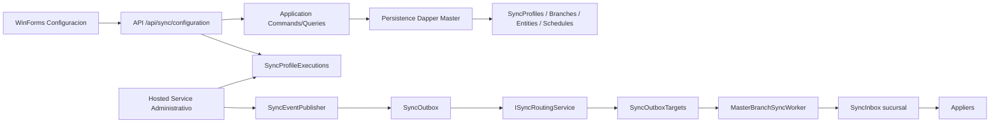

# Arquitectura de sincronizacion Maestro-Sucursal

Documento de arquitectura vigente para la configuracion administrativa y ejecucion Maestro-Sucursal. Complementa el analisis tecnico y la guia de usuario.

## Alcance

La version actual soporta solo direccion `MasterToBranch`. El modulo administrativo configura perfiles, sucursales, entidades, matriz entidad-sucursal, programacion y ejecuciones manuales. La publicacion y aplicacion de datos reutiliza la infraestructura Sync existente basada en Outbox/Targets/Inbox y el worker Master/Sucursal.

Quedan fuera: sincronizacion bidireccional, resolucion avanzada de conflictos, SQL ingresado por usuario, scripts personalizados, documentos transaccionales, adjuntos fisicos, BusinessPartners completo y disenador avanzado de mapeo de campos.

## Componentes

| Capa | Componente | Responsabilidad |
| --- | --- | --- |
| WinForms | `SyncProfileListForm`, `SyncProfileEditForm`, `SyncExecutionListForm`, `SyncExecutionDetailForm`, `ExecuteSyncProfileDialog` | Administracion y monitoreo. Consume API REST. |
| WinForms Services | `SyncConfigurationClient` | Cliente HTTP centralizado bajo `/api/sync/configuration`. No accede a SQL ni workers. |
| API | `SyncConfigurationEndpoints` | Endpoints administrativos protegidos por permisos. |
| API Hosted Service | `SyncProfileExecutionHostedService` | Orquesta ejecuciones administrativas pendientes/programadas y publica eventos. |
| Application | `Features/Sync/Configuration`, `Routing`, `Execution` | Casos de uso, validacion, ejecucion y routing. |
| Persistence | `Repositories/Sync` | Repositorios Dapper sobre Master y tablas Sync. |
| SQL | `069`, `070`, `071`, `072`, `073` | Modelo de configuracion, routing, ejecuciones, seguridad WinForms y hardening incremental. |
| Worker | `NuanSystem.MasterBranchSyncWorker` | Reclama outbox targets, entrega a sucursales y aplica inbox. |

## Flujo principal

## Contratos de seguridad

- WinForms no conoce cadenas de conexion, passwords, payload JSON completo, `SyncInbox`, `SyncOutboxTargets` ni stored procedures.
- API valida autenticacion, `X-Company-Code` cuando aplica y permisos `SYNC.CONFIGURATION.*`.
- Los errores se devuelven normalizados; no se deben propagar secretos ni SQL sensible al frontend.
- La base Master conserva configuracion global y secretos protegidos; las sucursales no conocen secretos de otras sucursales.

## Estados de ejecucion

Estados activos para polling y bloqueo de concurrencia: `Pending`, `Running`, `Cancelling`.

Estados terminales: `Cancelled`, `Completed`, `CompletedWithErrors`, `Failed`.

El frontend refresca cada 7 segundos solo mientras existan estados activos. El polling no debe solaparse y debe detenerse cuando el formulario se cierra o se dispone.

## Concurrencia

`database/sql/073_sync_master_branch_hardening.sql` redefine `SP_NA_CREATE_SYNCPROFILEEXECUTION` para reservar ejecuciones con `BEGIN TRANSACTION` y `UPDLOCK, HOLDLOCK` cuando `PreventConcurrentExecutions = 1`. Esto reduce la ventana de carrera entre la validacion de ejecuciones activas y la insercion de una nueva ejecucion `Pending`.

## Limites operativos

- La revision visual automatizada no reemplaza pruebas manuales en DevExpress real con DPI 100/125.
- El worker Master/Sucursal se mantiene como componente separado y no se duplica desde API o frontend.
- Las ejecuciones Full/Manual deben respetar `BatchSize`, `MaxRecords`, `RetryCount`, `RetryDelaySeconds` y `TimeoutSeconds`.
- La compatibilidad futura MySQL requiere aislar SQL Server en scripts/repositorios; la version actual sigue siendo SQL Server-first.
